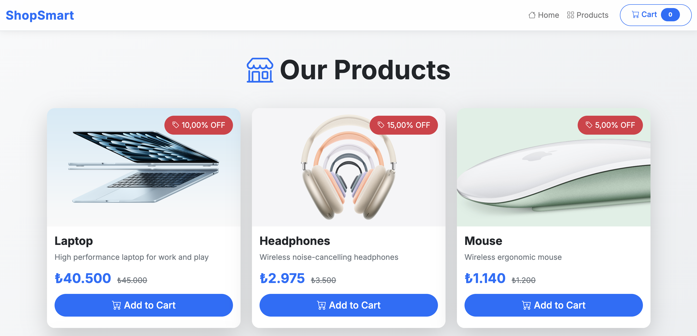
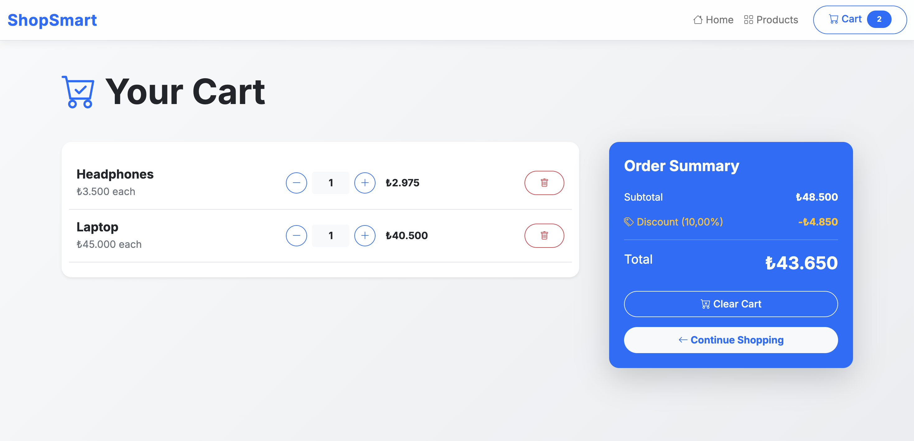

# ShopSmart · Online Shopping App


ASP.NET Core MVC e-commerce demo with session cart, EF Core, and a responsive Bootstrap UI.

## Features
- Product catalog with images, price display, and discount badges
- Shopping cart (add, remove, update quantity) persisted in session
- Discount engine: 10% off when subtotal ≥ ₺5,000 (centralized in `DiscountPolicy`)
- Modern UI: Bootstrap 5, Bootstrap Icons, pill toasts, mobile-friendly quantity controls
- Seed data with local product images

## Screenshots
| Home | Products | Cart |
|------|----------|------|
|  |  |  |


## Tech Stack
- **Backend:** ASP.NET Core MVC 8.0, EF Core 8
- **Database:** SQL Server (local instance or Docker)
- **Frontend:** Bootstrap 5, Bootstrap Icons
- **State:** Session-based cart
- **Patterns:** Repository, DI, centralized discount policy

## Run locally
```bash
git clone https://github.com/FerasJadallah/OnlineShoppingApp.git
cd OnlineShoppingApp
# create DB & apply migrations
dotnet ef database update
# run
dotnet run
# browse http://localhost:xxxx
```
If using Docker SQL Server:
```bash
docker run -e 'ACCEPT_EULA=Y' -e 'SA_PASSWORD=YourStrong!Passw0rd' -p 1433:1433 -d mcr.microsoft.com/mssql/server:2022-latest
```
Update `appsettings.json` connection string accordingly.

## Testing
```bash
dotnet test
```

## Project Structure
- `Controllers/` – Home, Products, Cart
- `Models/` – `Product`, `CartItem`
- `Services/` – `ICartService`, `SessionCartService`, `DiscountPolicy`, `ProductRepository`
- `Data/` – `AppDbContext`, `SeedData`
- `ViewComponents/` – `CartCount`
- `Views/` – Razor views for pages and partials
- `wwwroot/images/` – Local product images

## Discount Rule
- 10% discount applied when cart subtotal ≥ ₺5,000
- Logic lives in `Services/DiscountPolicy` and is used in controllers/views for both calculation and display

## Author
Feras Jadallah — Technical assessment project (.NET Core MVC)
